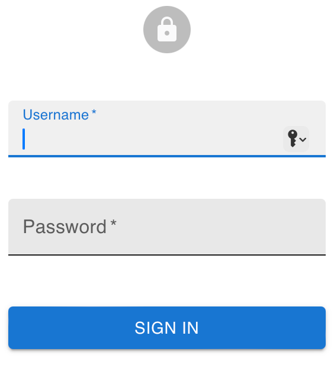
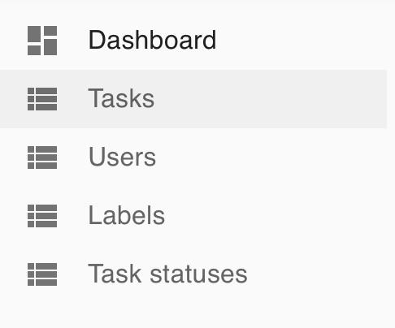
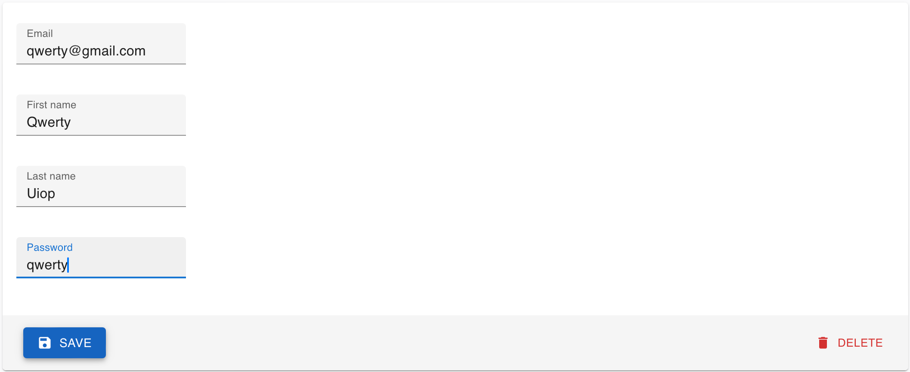
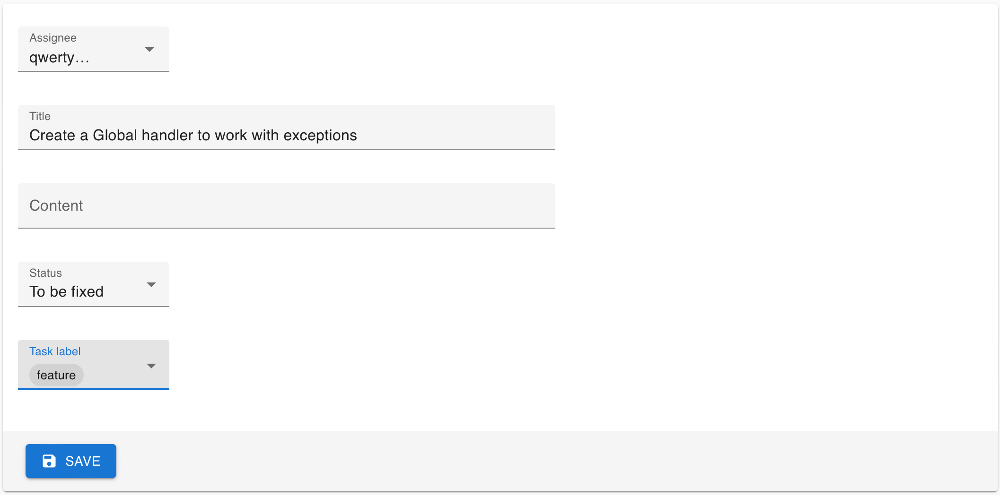

### Hexlet tests and linter status:
[](https://github.com/Kukuru5a/java-project-99/actions)

### Code Climate status & Test Coverage
<a href="https://codeclimate.com/github/Kukuru5a/java-project-99/maintainability"></a>

<a href="https://codeclimate.com/github/Kukuru5a/java-project-99/test_coverage"></a>

### Description
A project management tool through which a user can take the task or the admin can assign it to user. User friendly interface allows you to find all necessary information such as: user, task, task status, label
It can be easily sorted using the filter. The task can be created and assigned to user by admin.

### Setup 

```git clone``` to save it locally. ```make build``` to set it up. ```make run``` to start it up. the working route is on http://localhost:8080

#### [Deployed app](https://spring-boot-web-service.onrender.com)

### Guide
* Sign up the service as admin, using \
login: hexlet@example.com \
password: qwerty \



* Dashboard provides the user with a nav bar through which there is a possibility to create Task, User, Label, Task status.


* Admin is able to create the user, after waht the task can be attached to him.


* Task statuses may be attached by admin and user upon the task progression.

